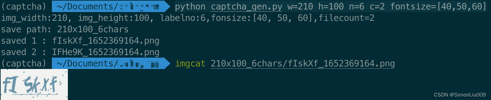

最近研究验证码识别，需要生成大量验证码，最方便的是使用`captcha`库来生成验证码，网上代码仅仅使用默认设置，但是它还有很多参数可以设定，于是我又添加了一些参数，方便使用。
# 效果图

# 参数解析
在上述案例中，完整命令为
```shell
python captcha_gen.py w=210 h=100 n=6 c=2 fontsize=[40,50,60]
```
其中：
- `w=210`指定验证码图片宽度
- `h=100`指定验证码图片高度
- `n=6`指定验证码字符长度
- `c=2`指定生成的验证码图片数量
- `fontsize=[40,50,60]`指定验证码字体大小（单个字符的字体大小从中随机选取）

参数默认值都写在代码里了。
其他例子：
```shell
python captcha_gen.py w=210 h=100 n=4 c=100
python captcha_gen.py n=6 c=100
python captcha_gen.py
```
